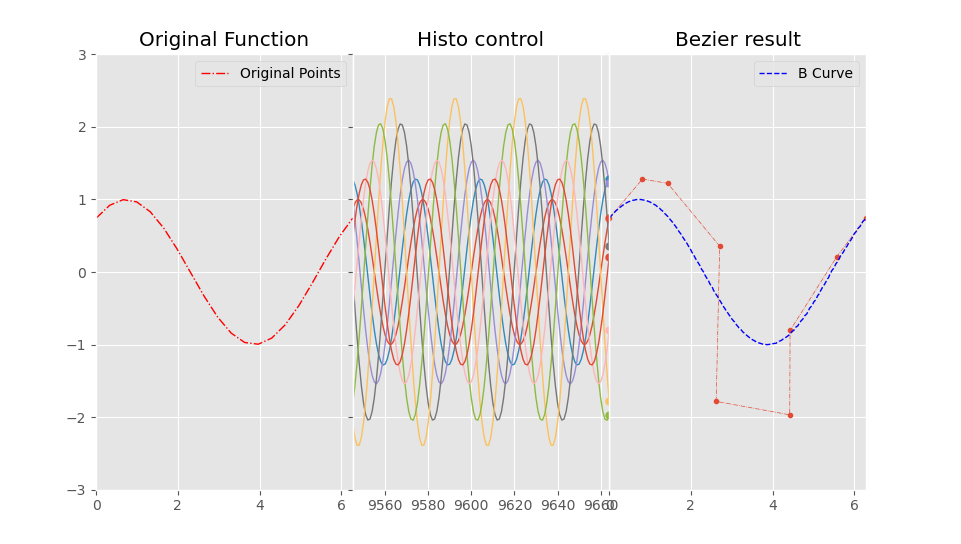

# bezier
Afin de m'entraîner à utiliser Matplotlib et Numpy, j'ai retravaillé des formules de Bezier existantes en veillant à ce qu'elles soient particulièrement biens optimalisées. Cela a représenté été un gros travail de retroingénérie et de reconstruction. 

Ensuite je me suis ensuite lancé dans l'affichage dynamique (animation avec Matplotlib) d'une fonction et de son équivalence en forme de Bézier. Durant l'affichage de la fonction initiale, j'affiche également sous forme graphique l'ensemble des paramètres appliqués pour construire la forme de Bézier à l'instant T (voir Bezier Result). Le défit dans ce cas a été d'obtenir une représentation graphique de ces paramètres 
afin qu'ils défilent en fonction du temps tel un oscilloscope (voir Histo Control). 

